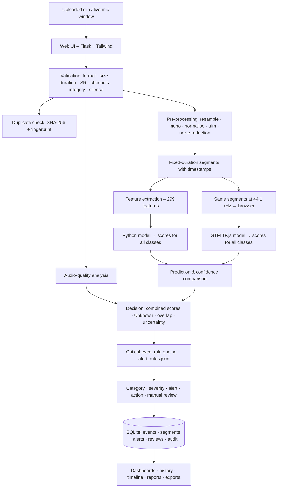

# SonicSentinel AI

**AI-powered, web-based, real-time sound-event detection and alerting system**

Theme: *AcousticX Intelligence* · Category: *NextWave AI and ML*

SonicSentinel AI listens to **uploaded audio clips** and **live microphone input**. It detects safety-critical and environmental sounds such as gunshots, screams, glass breaking, alarms and machinery faults, and raises alerts for the right people. Every audio segment is classified by **two independently trained models**:

| | Python model | Google Teachable Machine (GTM) model |
|---|---|---|
| Runs on | Flask server | the user's browser (TensorFlow.js, official GTM export) |
| Input | 299 acoustic features per 2-second segment (MFCC, Mel, chroma, spectral …) | 1-second spectrograms of the same audio segment |
| Trained on | `audio_dataset` TRAIN split (+ augmentation) | 1-second samples cut from the **same** TRAIN recordings |
| Selected algorithm | **XGBoost** (compared against Random Forest and MLP; SVM available) | TF.js speech-commands transfer learning (Teachable Machine) |

The app compares the two predictions and their confidence scores. It also checks audio quality, detects uncertain, unknown and overlapping sounds, applies configurable alert rules and assigns a severity (Informational → Critical). Doubtful results go to a manual-review queue. Everything is stored for event history, dashboards, reports and audit.

**Results (unseen test split, 695 clips):** accuracy **86.5 %** · macro-F1 **0.863** · critical-class recall Gunshot 0.93, Panic Scream 0.93, Aggression 0.89, Help 1.00, Glass Breaking 0.83.

**Deliverables:** [Project report](documentation/PROJECT_REPORT.md) · [Technical blog](documentation/TECHNICAL_BLOG.md) · Demo video: _link_ · Live app: _URL_ · [Submission checklist](documentation/SUBMISSION_CHECKLIST.md)


### Standout features

* **🔍 Why this prediction? (Explainable AI)** – every event page shows *where* the sound is ("Gunshot located at 1.29–1.85 s",
  highlighted on the spectrogram with per-segment Python and GTM confidence) and *why*: exact XGBoost TreeSHAP contributions
  grouped into 13 acoustic properties (onset, loudness, brightness, low/mid/high-frequency energy, timbre, pitch …), each
  marked high/low compared with the training data. API: `GET /api/events/<audio_id>/explain` · code: `src/services/explain.py`.
* **🧪 Robustness Lab** (`/lab`) – load your own clip or a random **unseen test** recording, then degrade it with sliders and
  presets (white noise, real background noise, echo, distance, volume, cheap phone microphone, cut-off start). The Python model
  (server) and the Teachable Machine model (browser) classify the modified audio live, and a one-click **stress test** plots both
  models' confidence from clean to 0 dB SNR. Uses the same augmentation code as training; nothing is stored as an event.
  Code: `src/services/lab.py`, `static/js/lab.js`, `templates/lab.html`.

---

## Table of contents

1. [Problem statement and objectives](#1-problem-statement-and-objectives)
2. [Sound classes](#2-sound-classes)
3. [System architecture and technology stack](#3-system-architecture-and-technology-stack)
4. [Functional requirements](#4-functional-requirements)
5. [Non-functional requirements](#5-non-functional-requirements)
6. [Dataset](#6-dataset)
7. [Audio pipeline and features](#7-audio-pipeline-and-features)
8. [Python model – training and results](#8-python-model--training-and-results)
9. [Google Teachable Machine model](#9-google-teachable-machine-model)
10. [Decision logic and alert rules](#10-decision-logic-and-alert-rules)
11. [Users and roles](#11-users-and-roles)
12. [Database](#12-database)
13. [Installation](#13-installation)
14. [Building the dataset and training (step by step)](#14-building-the-dataset-and-training-step-by-step)
15. [Running the application](#15-running-the-application)
16. [How to use](#16-how-to-use)
17. [Testing](#17-testing)
18. [Project structure](#18-project-structure)
19. [Limitations and future work](#19-limitations-and-future-work)
20. [Ethics, licences and AI usage](#20-ethics-licences-and-ai-usage)
21. [Deployment](#21-deployment)
22. [Assumptions](#22-assumptions)
23. [Troubleshooting](#23-troubleshooting)
24. [Screenshots](#24-screenshots)
25. [Deliverables and links](#25-deliverables-and-links)

---

## 1. Problem statement and objectives

Security staff and facility operators cannot listen to every camera, corridor or machine room all the time. Dangerous events are often **heard before they are seen**: a gunshot, a scream, breaking glass or a failing machine.

**Objectives**

* Detect 10 sound categories in uploaded clips and in a live microphone stream.
* Give a confidence score for every category from **two independent models** and compare them openly.
* Turn detections into **actionable alerts** with severity, recommended action and target role, while limiting false alarms (confidence thresholds, repeated-detection confirmation, model agreement, audio-quality checks).
* Send doubtful results to **human reviewers** instead of silently guessing.
* Keep a complete, searchable **history and audit trail**, with dashboards and downloadable reports.

---

## 2. Sound classes

Names must be **identical** in the Python model, the GTM model and `config/settings.py`.

| # | Class | Default severity | Alert | Who is notified | Recommended action (short) |
|---|---|---|---|---|---|
| 1 | Machinery Fault | High → Critical after 5 repeats | yes | maintenance | stop/isolate the machine, schedule inspection |
| 2 | Glass Breaking | High → Critical after 3 repeats | yes | security | check location / CCTV for break-in |
| 3 | Alarm or Siren | High | yes | security, maintenance | verify source, follow emergency procedure |
| 4 | Vehicle Horn | Low | logged only | – | traffic sound, no action |
| 5 | Animal Sound | Low | logged only | – | non-critical, check context |
| 6 | Gunshot | **Critical** | yes | security | alert security immediately, keep people away |
| 7 | Panic Scream | **Critical** | yes | security | send staff, check for injury |
| 8 | Aggression | High | yes | security | dispatch security, de-escalate |
| 9 | Person Asking for Help | **Critical** | yes | security | respond to the location immediately |
| 10 | Background Noise | Informational | no | – | no action |
| – | Unknown | Low | no | – | manual review |

**Critical-recall classes** (recall matters most): Gunshot, Glass Breaking, Panic Scream, Aggression, Person Asking for Help.

---

## 3. System architecture and technology stack



| Layer | Technology |
|---|---|
| Backend | Python 3.10–3.12, Flask 3, Flask-SQLAlchemy, Flask-Login |
| Database | SQLite (PostgreSQL possible via `SQLALCHEMY_DATABASE_URI`) |
| Audio | librosa, soundfile, soxr, noisereduce, SciPy, FFmpeg (MP3/M4A) |
| Machine learning | scikit-learn (MLP, Random Forest, SVM), XGBoost, joblib |
| GTM inference | TensorFlow.js 1.3.1 + speech-commands 0.4.0 (in the browser) |
| Frontend | Jinja2 templates, Tailwind CSS, vanilla JavaScript (Web Audio API) |
| Reports | matplotlib, openpyxl (Excel), HTML → print to PDF |
| Serving | `python run.py` (dev), waitress (Windows), gunicorn (Linux) |
| Tests | pytest (66 automated tests) |

More detail: [documentation/ARCHITECTURE.md](documentation/ARCHITECTURE.md).

---

## 4. Functional requirements

Status: Done

### 4.1 Users, authentication and roles

| ID | Requirement | Status |
|---|---|---|
| FR-01 | Users can register, log in, log out and edit their profile | Done |
| FR-02 | Each user gets a unique User ID (`USR-00001`, …) | Done |
| FR-03 | Five roles: Normal User, Audio Reviewer, Security Operator, Maintenance Operator, Administrator | Done |
| FR-04 | Account is locked temporarily after 5 failed logins | Done |
| FR-05 | Pages and API endpoints are restricted by role (403 page otherwise) | Done |
| FR-06 | Administrator can create users, change roles and deactivate accounts | Done |

### 4.2 Audio input

| ID | Requirement | Status |
|---|---|---|
| FR-07 | Single file upload with drag-and-drop and preview (play / pause / seek / volume) | Done |
| FR-08 | Batch upload of several files | Done |
| FR-09 | Live microphone monitoring with Start / Pause / Stop | Done |
| FR-10 | Microphone status shown: Available · Active · Paused · Disconnected · Permission denied | Done |
| FR-11 | Privacy banner visible while the microphone is on | Done |

### 4.3 Validation and pre-processing

| ID | Requirement | Status |
|---|---|---|
| FR-12 | Validate format (WAV, MP3, FLAC, OGG, M4A), size (≤ 25 MB), duration (0.5 s – 300 s), sample rate, channels, file integrity and silence | Done |
| FR-13 | Clear, user-friendly error messages for rejected files | Done |
| FR-14 | Pre-processing: resampling (22.05 kHz), mono conversion, peak normalisation, silence trimming, noise reduction | Done |
| FR-15 | Fixed-duration segmentation (2 s, 1 s hop) with timestamps; padding/truncation of the last segment | Done |

### 4.4 Audio quality and visualisation

| ID | Requirement | Status |
|---|---|---|
| FR-16 | Detect silence, clipping, noise/low SNR, low level, too-short duration, encoding problems, missing frames | Done |
| FR-17 | Quality label per file: Good / Acceptable / Poor / Unusable, with the list of issues | Done |
| FR-18 | Waveform image with segments and the deciding segment highlighted | Done |
| FR-19 | Mel spectrogram image | Done |

### 4.5 Classification and model comparison

| ID | Requirement | Status |
|---|---|---|
| FR-20 | Python model returns a confidence score for **every** class per segment | Done |
| FR-21 | GTM model runs in the browser on the **same** segments, without seeing the Python result | Done |
| FR-22 | Show top-3 classes of each model, all scores, \|Python top − GTM top\| difference and top-2 margins | Done |
| FR-23 | Comparison status: Acceptable Match / Weak Match / Model Disagreement / Uncertain Result | Done |
| FR-24 | Confidence level: High ≥ 85 %, Medium ≥ minimum confidence (60 %), Low below | Done |
| FR-25 | Unknown-sound handling when the combined confidence is below the unknown threshold | Done |
| FR-26 | Overlapping-sound detection (two or more non-background classes above the overlap threshold) | Done |
| FR-27 | Detect all 10 classes | Person Asking for Help has no training data yet | Done |

### 4.6 Decision, alerts and review

| ID | Requirement | Status |
|---|---|---|
| FR-28 | Configurable alert-rule engine per class (confidence, margin, repeats, model agreement, minimum quality, escalation, audience) | Done |
| FR-29 | Repeated-detection confirmation within a time window for live monitoring | Done |
| FR-30 | Severity assignment and escalation (Informational → Critical) and recommended action | Done |
| FR-31 | Real-time alerts with toast notifications on every page | Done |
| FR-32 | Alerts can be acknowledged, escalated or dismissed; alerts are routed to the correct role | Done |
| FR-33 | Alert history | Done |
| FR-34 | Manual review queue with segment playback, confirm/correct label, comments and override (original model outputs are kept) | Done |
| FR-35 | Every step of the decision is stored as a trace | Done |

### 4.7 History, dashboards, reports and administration

| ID | Requirement | Status |
|---|---|---|
| FR-36 | Search and filter history (ID, file name, class, dates, confidence, severity, quality, review status, user) | Done |
| FR-37 | Event timeline | Done |
| FR-38 | Dashboards: user, live, admin (trends, categories, confidence, quality, FP/FN, disagreements, alert response) | Done |
| FR-39 | Downloadable per-event report (HTML → print to PDF) | Done |
| FR-40 | CSV / Excel exports; model-comparison report on the test split (≥ 10 unseen clips per class) | Done |
| FR-41 | Admin can change thresholds and settings at runtime | Done |
| FR-42 | Admin alert-rule editor (JSON) with validation | Done |
| FR-43 | Audit trail of logins, uploads, reviews, alert actions and setting changes | Done |
| FR-44 | Anomaly notifications for administrators | Done |
| FR-45 | Model versions shown and stored with every prediction | Done |
| FR-46 | Data retention (audio 90 days, records 365 days by default) | Done |
| FR-47 | Exact-duplicate (SHA-256) and near-duplicate (re-encoded / trimmed / volume-changed) detection | Done |

---

## 5. Non-functional requirements

| ID | Category | Requirement | How it is met / current status |
|---|---|---|---|
| NFR-01 | Accuracy | Test accuracy ≥ 85 % | Done **86.5 %** (Python XGBoost, 695 unseen test clips, 10 classes) |
| NFR-02 | Accuracy | Macro-F1 ≥ 0.80 | Done **0.863** over all 10 classes |
| NFR-03 | Accuracy | Recall ≥ 85 % for critical classes | Done Gunshot 0.93 · Panic Scream 0.93 · Aggression 0.89 · Help 1.00 · 
| NFR-04 | Robustness | Keep working with background noise | Done noise-augmented training + quality gate; accuracy 0.81 at 20 dB SNR, 0.71 at 10 dB, 0.66 at 5 dB (see §8.4); Poor-quality audio goes to manual review |
| NFR-05 | Performance | 30-s upload ≤ 8 s · live prediction ≤ 3 s | 2-s live windows; GTM runs in the browser. Done measured with the real model: 30-s upload **1.5 s** (max 1.7 s), live window **0.11 s** – `reports/performance.md` |
| NFR-06 | Reliability | No crash on bad input | Validation rejects corrupt, empty, silent, too short and unsupported files with a clear message (tested) |
| NFR-07 | Reliability | Works when one model is missing | Without GTM the result uses the Python model only and is marked *Uncertain Result* |
| NFR-08 | Security | Protect accounts and data | Werkzeug password hashing, password policy (≥ 8 chars, letters + numbers), CSRF tokens on every POST, HttpOnly + SameSite session cookies, role checks, login lock-out, protected media routes |
| NFR-09 | Privacy | Users know when they are recorded | Red privacy banner while the mic is active; audio retention limits; anonymous speaker codes for recordings |
| NFR-10 | Usability | Simple web interface | Responsive Tailwind UI, drag-and-drop upload, colour-coded severity/quality badges, toasts |
| NFR-11 | Maintainability | Easy to change classes, thresholds, rules | All settings in `config/settings.py`, runtime settings in Admin, rules in `alert_rules/alert_rules.json`; modular packages; documentation folder |
| NFR-12 | Traceability | Reproduce any decision | Model version, both models' scores, quality, rule trace and reviewer changes stored per event; audit log |
| NFR-13 | Portability | Run on common machines | Windows 10/11, Linux, macOS; Python 3.10–3.12; Chrome or Edge |
| NFR-14 | Scalability | ≥ 20,000 events, concurrent users | Done 20,020 events: every page < 0.5 s, CSV export 1.3 s; 5 concurrent users, 0 errors. Benchmark inserts 20,000 events and times dashboard / history / filters / exports, plus 5 concurrent users; indexed columns; for larger installs point `SQLALCHEMY_DATABASE_URI` (`src/__init__.py`) to PostgreSQL; gunicorn/waitress |
| NFR-15 | Testability | Automated tests | 66 pytest tests on a temporary database and a tiny test-only model |
| NFR-18 | Availability | ≥ 99 % during evaluation hours | Done `run_server.bat` (waitress, 8 threads, automatic restart), `/healthz` health check (database + both models), Docker `HEALTHCHECK`, Render health check |
| NFR-16 | Data integrity | No train/test leakage | Split by original clip; augmented copies and segments stay in their parent's split; CV grouped by Audio ID |
| NFR-17 | Ethics | Responsible data use | Licensed datasets only, licence recorded per clip, consent for recordings, no real emergencies recorded |

---

## 6. Dataset

### 6.1 Sources

| Dataset | Used for | Licence | Link |
|---|---|---|---|
| UrbanSound8K | Alarm or Siren (`siren`), Vehicle Horn (`car_horn`), Animal Sound (`dog_bark`), Gunshot (`gun_shot`); Background: `air_conditioner`, `engine_idling`, `street_music`, `children_playing`, `drilling`, `jackhammer` | CC BY-NC 3.0 | https://urbansounddataset.weebly.com/urbansound8k.html |
| ESC-50 | Glass Breaking, Alarm or Siren (`siren`, `clock_alarm`), Vehicle Horn, Animal Sound (11 animal categories); Background: 35 everyday / look-alike categories (fireworks, thunderstorm, door knock, typing, coughing, laughing, crying baby, chainsaw …) | CC BY-NC 3.0 | https://github.com/karolpiczak/ESC-50 |
| MIMII (6 dB) | Machinery Fault (`abnormal`); Background (`normal` machinery) | CC BY-SA 4.0 | https://zenodo.org/records/3384388 |
| Kaggle gunshot audio dataset | Gunshot (9 weapons, round-robin) | see Kaggle page | Kaggle |
| Kaggle Human Screaming Detection | Panic Scream (`Screaming`); Background (`NotScreaming` voices) | see Kaggle page | Kaggle |
| VSD – Violence Sound Dataset | Aggression (one clip ≤ 6 s per annotated violence interval); Background (calm film audio) | see dataset page | – |
| Windows offline TTS (SAPI) | Person Asking for Help – the SRS phrases in several voices and speeds | synthetic | `scripts/generate_help_phrases_tts.py` |
| Team recordings (consented, anonymous codes) | Person Asking for Help, Background Noise of our rooms | own recordings | `scripts/record_samples.py` |

The raw downloads live in `downloads/` and are **not committed** (several GB). The label mapping is in `config/dataset_mapping.json`; the licence of every clip is written to `audio_dataset/raw/annotations.csv`.

### 6.2 Clips per class (original clips, after validation and de-duplication)

| Class | ESC-50 | UrbanSound8K | MIMII | Kaggle gunshot | Kaggle scream | VSD | TTS | Team | **Total** |
|---|---|---|---|---|---|---|---|---|---|
| Machinery Fault | | | 138 | | | | | | **138** |
| Glass Breaking | 40 | | | | | | | | **40** |
| Alarm or Siren | 80 | 393 | | | | | | | **473** |
| Vehicle Horn | 40 | 325 | | | | | | | **365** |
| Animal Sound | 400 | 374 | | | | | | | **774** |
| Gunshot | | 349 | | 382 | | | | | **731** |
| Panic Scream | | | | | 400 | | | | **400** |
| Aggression | | | | | | 298 | | | **298** |
| Person Asking for Help | | | | | | | 204 | 17 | **221** |
| Background Noise | 250 | 249 | 250 | | 250 | 150 | | 40 | **1,189** |
| **Total** | **810** | **1,690** | **388** | **382** | **650** | **448** | **204** | **57** | **4,629** |

* **Split** (stratified by class, by original clip): train 3,240 · validation 694 · test 695 (70 / 15 / 15).
* **Total audio:** ≈ 6.6 hours · mean clip length 5.1 s (0.5 s – 360 s).
* **Quality:** Good 3,195 · Acceptable 1,208 · Poor 226.
* **Rejected:** 241 files (near-silent / too short, exact duplicates) – listed in `data/dataset_rejected.csv`. This includes 73 team Help recordings made with the wrong microphone input (−64 to −75 dBFS).
* **Class imbalance ratio:** 30 : 1 before augmentation, ≈ 1 : 1 in the balanced training split.
* **Format:** every clip is converted to 44.1 kHz mono 16-bit WAV and gets a unique Audio ID (`AUD-000001` …).
* Default import caps: 400 clips per class per source, 250 per source for Background Noise (`scripts/import_local_downloads.py`).

### 6.3 Augmentation (training split only)

`python -m augmentation.augment --per-clip 1 --balance-to 600` creates augmented copies of **training** clips with a random mix of: background-noise mixing at a random SNR, time shift, pitch shift (±2 semitones), time stretch (0.85–1.15×), volume change (−12 to +6 dB), synthetic room reverberation, distance simulation and device (band-pass) simulation. Small classes get more copies (up to 10 per clip) until each class has ≈ 600 training clips. Augmented copies keep their parent's Audio ID in `parent_audio_id`, so they never leak into validation or test. Re-running the command replaces the previous augmented set.

For the installed model: **8,270 training clips** (3,240 originals + 5,030 augmented) → **38,210 training segments** × 299 features.

### 6.4 Known gaps

* **Glass Breaking:** only 40 clips (6 in the test split) – add the `glassbreak` events of [TUT Rare Sound Events 2017](https://zenodo.org/records/401395) (`...source_data_events.zip`, non-commercial licence) to `downloads/glass_extra/`, then import → build → augment → train.
* **Machinery Fault:** 138 clips from one MIMII recording set – add more MIMII machine types / SNR levels.
* **Person Asking for Help:** mostly synthetic TTS voices + 17 team clips – more real, consented voices would make it more robust.

---

## 7. Audio pipeline and features

1. **Load** – soundfile for WAV/FLAC/OGG, FFmpeg for MP3/M4A.
2. **Validate** – format, size, duration, sample rate, channels, integrity, silence.
3. **Quality analysis** – RMS level, clipping ratio, estimated SNR/noise floor, silence ratio, missing frames → Good/Acceptable/Poor/Unusable.
4. **Pre-process** – mono, resample to 22,050 Hz, peak-normalise, trim silence, spectral-gating noise reduction.
5. **Segment** – 2.0 s windows with a 1.0 s hop; last segment padded.
6. **Extract 299 features per segment:**

| Feature group | Values |
|---|---|
| 40 MFCC – mean and standard deviation | 80 |
| 40 delta-MFCC – mean | 40 |
| 64 log-Mel bands – mean and standard deviation | 128 |
| 12 chroma bins – mean and standard deviation | 24 |
| 7 spectral-contrast bands – mean | 7 |
| ZCR, RMS, spectral centroid, bandwidth, roll-off, onset strength – mean / std / max | 18 |
| Spectral flatness (mean) and tempo | 2 |
| **Total** | **299** |

7. **Clip-level aggregation** (same rule for both models): if any segment has a non-background class at or above the minimum confidence, the clip takes the scores of the strongest such segment; otherwise the mean of all segments. A short gunshot in a long clip is therefore not averaged away.

---

## 8. Python model – training and results

### 8.1 Training procedure

* Candidates: **SVM (RBF)**, **Random Forest**, **XGBoost**, **MLP** (256-128 hidden units, early stopping), each inside a `StandardScaler` pipeline.
* Tuning: `GridSearchCV` with **GroupKFold(3)** grouped by original Audio ID, scored by macro-F1.
* Selection: best **clip-level macro-F1 on the validation split** (critical-class recall breaks ties).
* The test split is used **once**, for the final report.
* Quiet segments of event clips are dropped from training (a silent part of a gunshot clip is not a gunshot).

Run used for the installed model: `python -m python_models.train_models --fast --models rf,mlp,xgb`. SVM was skipped because it takes hours on 38k segments (it is still available: `--models svm`). XGBoost is skipped automatically if a class has no training data.

### 8.2 Model comparison (validation split, 694 clips)

| Model | Best parameters | CV macro-F1 | Val accuracy | Val macro-F1 | Val macro precision | Val macro recall | Training time |
|---|---|---|---|---|---|---|---|
| **XGBoost** Done selected | max_depth 6, learning_rate 0.1 | 0.790 | **0.844** | **0.847** | 0.858 | 0.850 | 1,462 s |
| MLP (256-128) | alpha 0.001 | 0.779 | 0.805 | 0.818 | 0.805 | 0.848 | 292 s |
| Random Forest (300 trees) | max_depth None, min_samples_leaf 1 | 0.742 | 0.769 | 0.802 | 0.880 | 0.771 | 953 s |

### 8.3 Final test results (695 unseen clips) – XGBoost

| Metric | Value | SRS target |
|---|---|---|
| Accuracy | **0.865** | ≥ 0.85 Done |
| Macro precision / recall / F1 | 0.847 / 0.895 / **0.863** | F1 ≥ 0.80 Done |

| Class | Precision | Recall | F1 | Test clips | False positives | False negatives |
|---|---|---|---|---|---|---|
| Machinery Fault | 0.77 | 1.00 | 0.87 | 20 | 6 | 0 |
| Glass Breaking | 0.56 | 0.83 | 0.67 | 6 | 4 | 1 |
| Alarm or Siren | 0.93 | 0.92 | 0.92 | 71 | 5 | 6 |
| Vehicle Horn | 1.00 | 0.87 | 0.93 | 55 | 0 | 7 |
| Animal Sound | 0.88 | 0.79 | 0.84 | 116 | 12 | 24 |
| Gunshot | 0.96 | 0.93 | 0.94 | 110 | 4 | 8 |
| Panic Scream | 0.64 | 0.93 | 0.76 | 60 | 32 | 4 |
| Aggression | 0.89 | 0.89 | 0.89 | 45 | 5 | 5 |
| Person Asking for Help | 1.00 | 1.00 | 1.00 | 33 | 0 | 0 |
| Background Noise | 0.84 | 0.78 | 0.81 | 179 | 26 | 39 |

An earlier 9-class MLP (without Help) reached 93.1 % accuracy but only 0.819 macro-F1; the 10-class XGBoost is the better and complete model.

Confusion matrix: `reports/confusion_matrix_python.png`.

### 8.4 Noise robustness (white noise added to the test clips)

| Condition | Accuracy | Macro-F1 |
|---|---|---|
| Clean | 0.865 | 0.863 |
| SNR 20 dB | 0.809 | 0.780 |
| SNR 10 dB | 0.711 | 0.602 |
| SNR 5 dB | 0.663 | 0.529 |

Model `py-xgb-20260924-0800`. Audio this noisy is also marked Poor quality, and Poor-quality detections of critical classes go to manual review instead of raising an automatic alert.

Report files: `reports/python_model_comparison.csv`, `python_test_metrics.json`, `python_classwise_test.csv`, `noise_robustness.csv`, `confusion_matrix_python.png`. The Admin → **Models** page shows them.

---

## 9. Google Teachable Machine model

* **Classes:** the same 10 classes as the Python model. Run 1 (first export) had 9; run 2 adds Person Asking for Help using the `--zip` upload below – replace `gtm_model/model/` with the run-2 export. Sample counts, configuration, observations and screenshots are in [documentation/GTM_TRAINING_LOG.md](documentation/GTM_TRAINING_LOG.md), together with sample counts, configuration, observations and screenshots.
* **Training data:** 1-second, 44.1 kHz samples cut from the **same TRAIN recordings** as the Python model: `python -m gtm_model.prepare_gtm_samples --max-per-class 400 --zip`. Teachable Machine's audio *Upload* only accepts archives in its own format, so the script writes one archive per class in exactly that format (`samples.json` with the spectrogram of every sample, computed like Teachable Machine's own recorder, + `.webm` audio) to `gtm_model/training_samples/_tm_upload/<Class>.zip`. Each class is filled with **Upload → <Class>.zip** – no speaker → microphone recording. (Run 1 used the old playlist + microphone method, `--playlist`.)
* **Export:** TensorFlow.js (`speech-commands` 0.4.0, model name TMv2), installed in `gtm_model/model/` (`model.json`, `metadata.json`, `weights.bin`).
* **Inference in the app:** `static/js/gtm.js` loads the model with `speechCommands.create("BROWSER_FFT", …)`. For uploads and live windows it computes the same spectrogram the Web Audio `AnalyserNode` would produce (44.1 kHz, FFT 2048, 43 frames × 232 bins) and calls `recognizer.recognize()`. Segments longer than 1 s are classified in 1-s windows with a 0.5-s hop and averaged. Scores are posted to `/api/events/<id>/gtm`.
* **Independence:** GTM never receives the Python prediction; the server combines the two only after both are stored.

Full steps: [gtm_model/README.md](gtm_model/README.md).

---

## 10. Decision logic and alert rules

1. **Compare** the top class and confidence of each model (`|py_top − gtm_top|`):
   * both below minimum confidence → **Uncertain Result**
   * same class, difference ≤ 0.20, both confident → **Acceptable Match**
   * same class otherwise → **Weak Match**
   * different classes → **Model Disagreement**
2. **Combine** – average of the two score vectors; below the unknown threshold → **Unknown**.
3. **Overlap** – two or more non-background classes above the overlap threshold → overlapping sounds.
4. **Rule check** for the category (`alert_rules/alert_rules.json`): minimum confidence, top-2 margin, minimum quality, optional model agreement, repeated detection (N consecutive windows **or** both models above `strong_confidence`), escalation after repeats.
5. **Alert** when all conditions hold; otherwise *Pending Confirmation* and manual review for critical classes.
6. **Manual review** when models disagree, confidence is low, quality is poor, top-2 scores are close, sounds overlap, the sound is unknown, or a critical event is unconfirmed.

| Rule | Severity | Alert | Min conf. | Consecutive | Strong conf. | Audience |
|---|---|---|---|---|---|---|
| Machinery Fault | High | yes | 0.65 | 2 | 0.85 | maintenance |
| Glass Breaking | High | yes | 0.65 | 2 | 0.80 | security |
| Alarm or Siren | High | yes | 0.65 | 2 | 0.85 | security, maintenance |
| Vehicle Horn | Low | no | 0.60 | 1 | – | security |
| Animal Sound | Low | no | 0.60 | 1 | – | security |
| Gunshot | Critical | yes | 0.70 | 2 | 0.85 | security |
| Panic Scream | Critical | yes | 0.65 | 1 | – | security |
| Aggression | High | yes | 0.65 | 1 | – | security |
| Person Asking for Help | Critical | yes | 0.65 | 1 | – | security |
| Background Noise | Informational | no | 0.50 | 1 | – | – |

**Runtime settings (Admin → Settings):** segment 2.0 s · hop 1.0 s · live window 2.0 s · min confidence 0.60 · top-2 margin 0.15 · acceptable-match difference 0.20 · unknown threshold 0.35 · overlap threshold 0.25 · repeat window 10 s · noise reduction on · background-noise limit −20 dB · audio retention 90 days · record retention 365 days.

---

## 11. Users and roles

| Role | Can do |
|---|---|
| Normal User | upload, live monitoring, own events, own dashboard and reports |
| Audio Reviewer | + review queue: listen, confirm/correct labels, comment, override |
| Security Operator | + security alerts: acknowledge, escalate, dismiss |
| Maintenance Operator | + maintenance alerts (Machinery Fault, alarms) |
| Administrator | everything: users, settings, alert rules, models, evaluation, exports, audit trail, retention |

Default accounts created by `python -m database.init_db` (**change the passwords after the first login**):

| Username | Password | Role |
|---|---|---|
| admin | Admin@12345 | Administrator |
| reviewer | Review@12345 | Audio reviewer |
| security | Secure@12345 | Security operator |
| maintenance | Maint@12345 | Maintenance operator |
| evaluator | Eval@12345 | Normal user |

---

## 12. Database

SQLite file `data/sonicsentinel.db` (not committed). Tables:

| Table | Stores |
|---|---|
| `users` | accounts, roles, password hashes, lock-out state |
| `live_sessions` | microphone sessions |
| `audio_events` | one row per upload / live window: metadata, quality, both models' scores, comparison, decision, severity, status, model versions |
| `segments` | per-segment timestamps and scores |
| `alerts` / `alert_actions` | raised alerts and acknowledge / escalate / dismiss actions |
| `reviews` | reviewer decisions, corrected labels, comments |
| `audit_logs` | who did what and when |
| `system_notifications` | anomaly notifications for admins |
| `settings` | runtime settings |
| `model_versions` | registered Python and GTM model versions |

Column-level details: [documentation/DATA_DICTIONARY.md](documentation/DATA_DICTIONARY.md) · schema: `database/schema.sql`.

---

## 13. Installation

**Requirements:** Windows 10/11 (Linux/macOS also work), **Python 3.10–3.12** (Anaconda is fine), **FFmpeg** on PATH (`winget install Gyan.FFmpeg`), Chrome or Edge, 8 GB RAM (16 GB recommended for training).

```powershell
cd "C:\Users\CZ\Desktop\SonicSentinel AI"
python -m venv .venv
.venv\Scripts\Activate.ps1          # Anaconda users can use the base environment instead
python -m pip install --upgrade pip
pip install -r requirements.txt
python -m database.init_db           # creates data/sonicsentinel.db + default accounts
python -m pytest -q                  # 66 tests should pass
```

> Always quote version specifiers on the command line (`pip install "flask>=3.0"`), otherwise Windows treats `>` as a redirect and creates empty files named `3.0`, `2.0` …

Optional environment variables: `SONIC_SECRET_KEY` (always set in production), `SONIC_DB_PATH`, `SONIC_DATA_DIR`, `SONIC_MODEL_PATH`, `SONIC_GTM_DIR`, `SONIC_RULES_PATH`, `PORT`, `HOST`.

---

## 14. Building the dataset and training (step by step)

Detailed guide in Urdu/English: [RUN_AND_TRAIN_GUIDE.md](RUN_AND_TRAIN_GUIDE.md).

```powershell
# 1. Put the public datasets in downloads/ (see §6.1), then import them
python scripts\clean_dataset.py --yes          # optional: start from an empty dataset (keeps rec_* / tts_* recordings)
python scripts\import_local_downloads.py        # defaults: 1200 per class, 400 per source, 250 background per source
#    (official folder layouts / FSD50K:  python scripts\import_public_datasets.py --fsd50k D:\data\FSD50K)

# 2. Optional own recordings / synthetic help phrases
pip install sounddevice pyttsx3
python scripts\record_samples.py --list-devices                 # find your microphone number
python scripts\record_samples.py --input 1 --class "Background Noise" --speaker S00 --count 30 --seconds 5
python scripts\record_samples.py --input 1 --class "Person Asking for Help" --speaker S01 --count 30   # clips below -45 dBFS are refused
python scripts\generate_help_phrases_tts.py --per-phrase 15

# 3. Validate, de-duplicate, assign Audio IDs, 70/15/15 split
python scripts\build_dataset.py --min-per-class 10

# 4. Augment the TRAIN split only
python -m augmentation.augment --per-clip 1 --balance-to 600

# 5. Train and evaluate the Python model
python -m python_models.train_models --fast --models rf,mlp,xgb   # used for the installed model (~45 min)
python -m python_models.train_models                            # full grids, all models (slow)

# 6. Prepare GTM samples, then train in Teachable Machine (see gtm_model/README.md)
python -m gtm_model.prepare_gtm_samples --max-per-class 400 --zip   # upload _tm_upload/<Class>.zip in Teachable Machine
```

Features are cached in `data/features/`, so re-running training does not re-extract them.

---

## 15. Running the application

```powershell
python run.py                         # http://127.0.0.1:5000
python run.py --host 0.0.0.0          # LAN access (the microphone needs https or localhost)
run_server.bat                        # production on Windows: waitress + automatic restart (health: /healthz)
gunicorn -w 2 -b 0.0.0.0:$PORT run:app   # production on Linux
```

---

## 16. How to use

| Task | Where |
|---|---|
| Register / log in | `/register`, `/login` |
| Upload and preview audio | **Upload** (drag and drop) or **Batch** |
| Metadata, waveform, spectrogram, quality | event page after the upload |
| Python and GTM predictions | event page → *Model prediction & confidence comparison* |
| Live monitoring | **Live** → Start (allow the microphone; a red banner stays on while it is active) |
| Alerts | **Alerts** → Acknowledge / Escalate / Dismiss; toasts appear on every page |
| Manual review | **Review** → listen, confirm or correct, comment, close |
| Dashboards | **Dashboard**, **Live**, **Admin** |
| History and timeline | **History** filters, **Timeline** |
| Reports and exports | event page → *Download report*; Admin → CSV/Excel exports |
| Model comparison report | Admin → *Model comparison* → *Run test-set evaluation* → export Excel |
| Thresholds and rules | Admin → *Settings*, Admin → *Alert rules* |

**Common modifications**

| Change | How |
|---|---|
| New sound class | add it to `CLASSES` in `config/settings.py`, add data under `audio_dataset/raw/<Class>/`, rebuild, retrain both models (same name in GTM), add a rule in Admin → Alert rules |
| Confidence threshold | Admin → Settings → *min confidence* (or per class in Alert rules) |
| New audio format | add the extension to `SUPPORTED_FORMATS` |
| Segment duration | Admin → Settings → *segment seconds* / *live window seconds*, then retrain the Python model |

---

## 17. Testing

```powershell
python -m pytest -q        # 66 passed
```

Covered: functional and integration (upload → Python → GTM → decision → review → alerts → live), boundary (too-short clip, last-segment padding, exact thresholds), negative (unsupported / empty / corrupt / silent files, wrong password, bad CSRF), security (CSRF, role access, lock-out, protected media), database, audio formats (WAV, FLAC, OGG, MP3, stereo), silence / clipping / noise, pre-processing and features, model aggregation, comparison and alert rules, duplicates, low confidence, unknown and overlapping sounds, live windows.

Synthetic test files for manual checks are in `sample_audio/test_cases/` (silent, too short, corrupted, not audio, clipped, very low level, white noise, missing frames, stereo FLAC).

**Performance and scalability** (NFR): `python scripts\benchmark_performance.py` times five 30-s uploads (target ≤ 8 s) and 15 live windows (≤ 3 s), inserts 20,000 events and times the dashboard, history, filters and exports, and runs 5 concurrent users. It uses a temporary database and your real model, and writes `reports/performance.md`.

Details and the manual checklist: [documentation/TESTING.md](documentation/TESTING.md).

---

## 18. Project structure

```
alert_rules/          alert_rules.json (editable in the admin UI)
audio_dataset/        raw/<Class>/ and processed/<split>/<Class>/  (not committed)
audio_preprocessing/  loader, validation, pre-processing, quality analysis
augmentation/         training-only augmentation
config/               settings, class list, dataset label mapping
data/                 database, uploads, features cache (not committed) + dataset metadata/statistics
database/             init_db.py, schema.sql
documentation/        report, blog, architecture, data dictionary, dataset guide, testing, deployment, GTM log, video script, checklists
downloads/            downloaded public datasets (not committed)
feature_extraction/   299-value features, waveform/spectrogram images, fingerprints
gtm_model/            GTM sample preparation; exported model in gtm_model/model/
notebooks/            exploration notebook
python_models/        training script, inference wrapper, saved/sonic_model.joblib
reports/              model comparison, test metrics, class-wise scores, confusion matrix, noise robustness
sample_audio/         synthetic test clips
scripts/              dataset import (local + public), build, clean, recording, TTS, benchmark
screenshots/          application and GTM screenshots
src/                  Flask app: models, routes, services (analysis, decision, rules, audit …)
static/, templates/   Tailwind UI, gtm.js (browser GTM), live.js, batch.js
tests/                pytest suite
RUN_AND_TRAIN_GUIDE.md  step-by-step setup and training guide
DEVELOPMENT_LOG.md      daily log (work, problems, dataset changes, results)
AI_USAGE.md             AI tool usage declaration
Dockerfile, render.yaml  container image and Render deployment
```

---

## 19. Limitations and future work

* **Glass Breaking** (40 clips, 6 test clips) and **Machinery Fault** (138 clips, one recording set) are small; their scores are less reliable and Glass Breaking recall (0.83) is just below the 0.85 target.
* **Person Asking for Help** is trained mostly on synthetic TTS voices; real voices, accents and languages may be missed.
* **Panic Scream** has the most false positives (loud voices, children, some animals).
* The **GTM model** was trained from speaker playback through the microphone, so it is less accurate than the Python model and often disagrees with it; the installed version has 9 classes.
* Accuracy drops with strong noise (0.69 at 5 dB SNR in the last measurement).
* GTM runs in the browser, so uploads need an open browser tab to get GTM scores.
* Help-phrase detection is sound classification, not speech recognition; it only knows the trained phrases.
* SQLite suits a single server; use PostgreSQL for many concurrent users.

**Future work:** more Glass Breaking / MIMII / real help-voice data, GTM retraining with 10 classes and more samples, a pretrained audio-embedding model (YAMNet/PANNs) as another candidate, SMS/e-mail notifications, multi-room monitoring, and feeding reviewer corrections back into training.

---

## 20. Ethics, licences and AI usage

* Only licensed public datasets are used; the licence of every clip is recorded. Raw audio is **not redistributed** in this repository.
* People are recorded only with consent and anonymous speaker codes (`S01`); no real emergencies are recorded.
* AI tools used during development are declared in [AI_USAGE.md](AI_USAGE.md). The application itself calls **no** generative-AI API: classification comes only from the team's Python and GTM models.
* Project licence: see [LICENSE](LICENSE).

---

## 21. Deployment

The repository contains a `Dockerfile` (Python 3.11, FFmpeg, gunicorn) and a Render Blueprint (`render.yaml`). Full guide: [documentation/DEPLOYMENT.md](documentation/DEPLOYMENT.md).

1. Commit the trained models (`python_models/saved/sonic_model.joblib`, `gtm_model/model/`), pin the library versions you trained with in `requirements.txt`, push to GitHub.
2. Render → **New + → Blueprint** → select the repository → **Apply** (HTTPS is included, which the microphone needs).
3. Log in as `admin`, change the password, and give evaluators the `evaluator / Eval@12345` account.

Without Docker: `run_server.bat` (Windows, waitress with automatic restart) or `gunicorn -w 1 --threads 4 -b 0.0.0.0:$PORT run:app` (Linux).

---

## 22. Assumptions

* Users have a modern browser (Chrome / Edge) with Web Audio and microphone permission; the live monitor runs on `localhost` or HTTPS.
* One sound source dominates each 2-s segment most of the time; overlapping sounds are flagged, not separated.
* Public datasets are representative enough of real sounds; the demo room's own noise is recorded as Background Noise.
* The server has 2+ CPU cores and ≥ 2 GB RAM for inference (8–16 GB for training).
* Alerts are advisory: a human acknowledges, escalates or dismisses them; the system does not call emergency services.
* Class names are identical in `config/settings.py`, the Python model and the GTM `metadata.json`.

---

## 23. Troubleshooting

| Problem | Fix |
|---|---|
| `ffmpeg not found` / MP3 cannot be read | install FFmpeg (`winget install Gyan.FFmpeg`), reopen the terminal, `ffmpeg -version` |
| Training looks frozen in Anaconda Prompt | the window is in *Select* mode – press **Esc**; turn off *QuickEdit Mode* in the window properties |
| Ctrl+C does not stop training | close the window, or `taskkill /F /IM python.exe` from another window |
| `git` says `index.lock` exists | close editors/git windows, delete `.git\index.lock`, retry |
| Empty files named `3.0`, `2.0` appear | quote version specifiers: `pip install "flask>=3.0"` |
| GTM column says "model not loaded" | put `model.json`, `metadata.json`, `weights.bin` in `gtm_model/model/`, hard-refresh (Ctrl+F5) |
| Live monitor: no microphone | allow the mic in the browser (lock icon), use `localhost` or HTTPS, close other apps using the mic |
| Recorded clips are rejected as silent | `python scripts\record_samples.py --list-devices`, then `--input N` with your real microphone |
| Old / wrong predictions after retraining | the Python model is reloaded automatically when `sonic_model.joblib` changes; for a new GTM model hard-refresh the browser (Ctrl+F5) |
| Is the server up? | open `/healthz` – shows database, Python model and GTM model status |
| Teachable Machine says "only upload zips created here" | upload the files from `gtm_model/training_samples/_tm_upload/` (made with `--zip`), not WAV files |
| Features look wrong after rebuilding the dataset | delete `data\features\` (or run `clean_dataset.py --yes`) and retrain |
| `database is locked` | only one app instance at a time; stop other `run.py` windows |
| Port 5000 in use | `python run.py --port 5050` |

---

