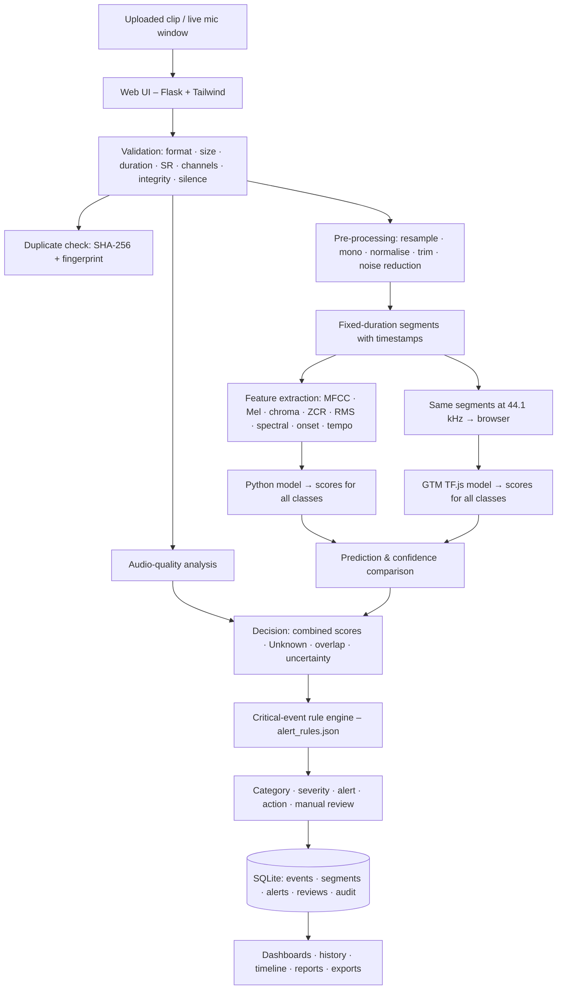

# Architecture

## Modules

| Module | Responsibility |
|---|---|
| `audio_preprocessing/loader.py` | decode WAV/FLAC/OGG (soundfile) or MP3/M4A (FFmpeg); metadata |
| `audio_preprocessing/validation.py` | user-friendly validation errors |
| `audio_preprocessing/preprocess.py` | the cleaning chain, shared by training and inference |
| `audio_preprocessing/quality.py` | quality metrics and the Good/Acceptable/Poor/Unusable label |
| `feature_extraction/features.py` | the 299-value feature vector per segment |
| `feature_extraction/visuals.py` | waveform and Mel-spectrogram PNGs |
| `feature_extraction/fingerprint.py` | near-duplicate detection |
| `python_models/train_models.py` | training, tuning, selection, test metrics, noise robustness |
| `python_models/inference.py` | model loading, per-class scores, clip-level aggregation |
| `static/js/gtm.js` | GTM loading + spectrogram computation + inference in the browser |
| `src/services/analysis.py` | orchestrates the whole pipeline for uploads and live windows |
| `src/services/decision.py` | comparison, uncertainty, overlap, manual-review routing, final decision |
| `src/services/rules.py` | alert-rule loading, validation and evaluation |
| `src/services/audit.py` | audit trail and anomaly notifications |
| `src/routes/*` | pages and JSON API, grouped by feature |

## Decision flow

1. **Compare.** Take the top class and confidence of each model and compute `|py_top − gtm_top|`.
   * Both models below the minimum confidence → **Uncertain Result**
   * Same class, difference ≤ 0.20, both confident → **Acceptable Match**
   * Same class otherwise → **Weak Match**
   * Different classes → **Model Disagreement**
2. **Combine.** Average the two score vectors. If the best combined score is below the unknown threshold, the result is **Unknown**.
3. **Overlap.** If two or more non-background classes are ≥ the overlap threshold, report **overlapping sounds**.
4. **Apply the rule for the category.** Check confidence, top-2 margin, audio quality and model agreement (if the rule requires it). Then check repeated detection: the event must appear in N consecutive segments/windows, **or** both models must agree above the rule's `strong_confidence`. Severity escalates when the event keeps repeating.
5. **Alert.** If every condition holds → **Alert Generated**. If a critical rule is not met → *Pending Confirmation* + manual review. Background noise above the noise limit → noise alert.
6. **Manual review** if any of these is true: the models disagree, low confidence, poor quality, similar top-2 scores, overlap, unknown sound, a critical event without confirmation, or a possible false alarm.
7. **Status.** Manual Review › Alert Generated › Uncertain › Classified. A reviewer can later mark the event Reviewed or Closed.

## Clip-level aggregation (identical for both models)

If any segment has a non-background class at or above the minimum confidence, the clip takes the scores of the strongest such segment. Otherwise it takes the mean of all segments. This stops a short gunshot in a long clip from being averaged away.
