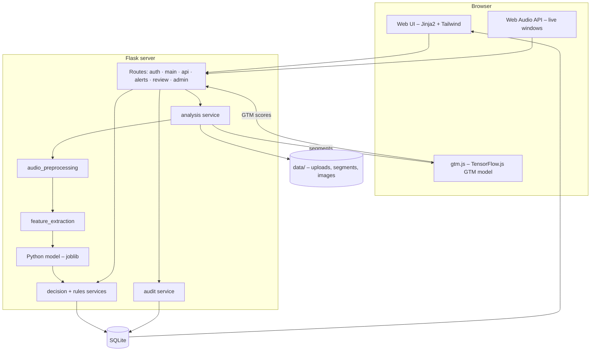
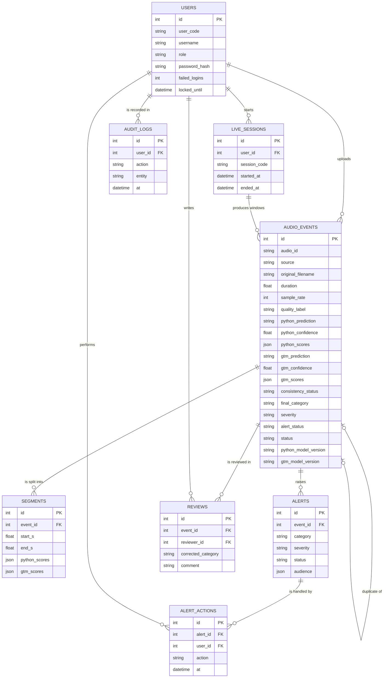
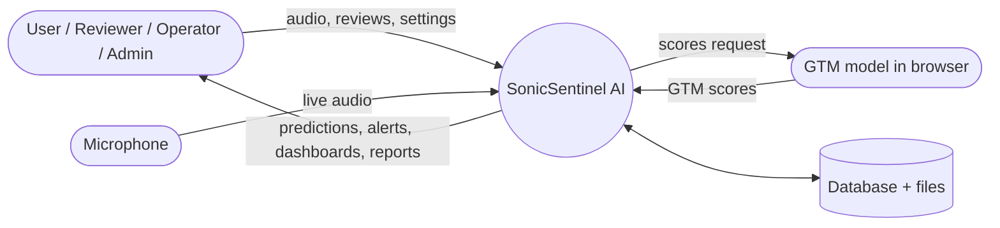
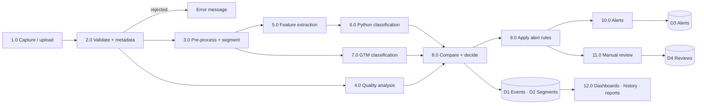
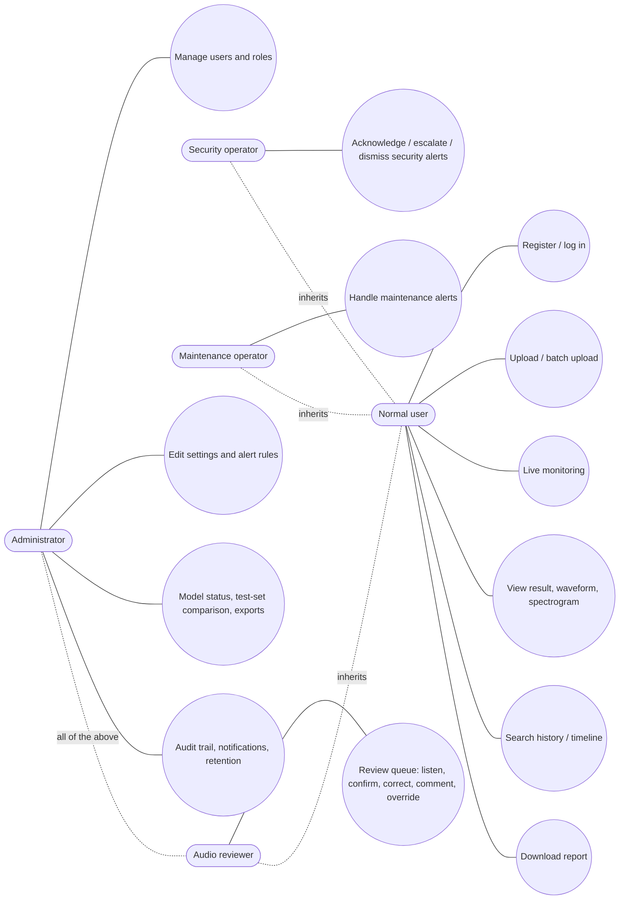
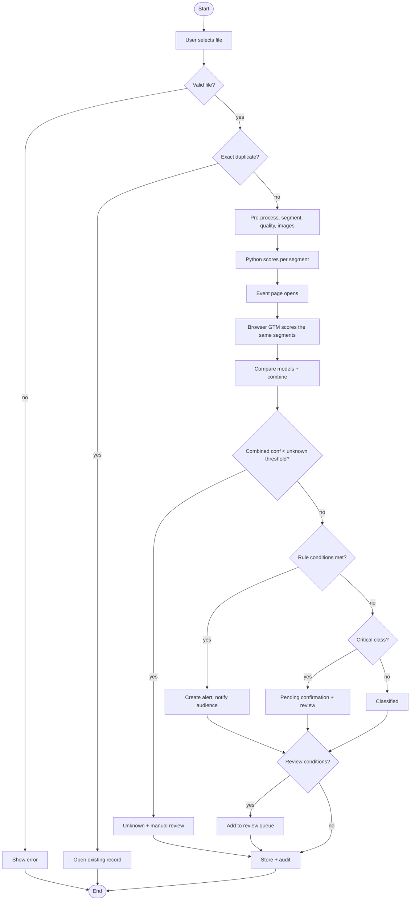
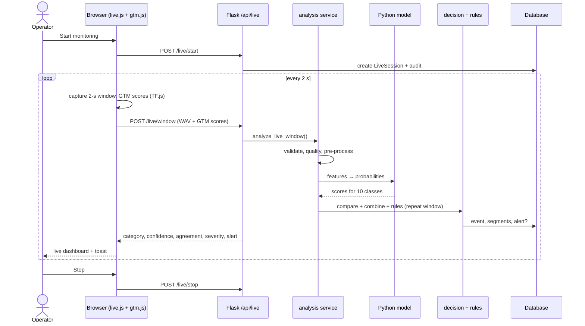
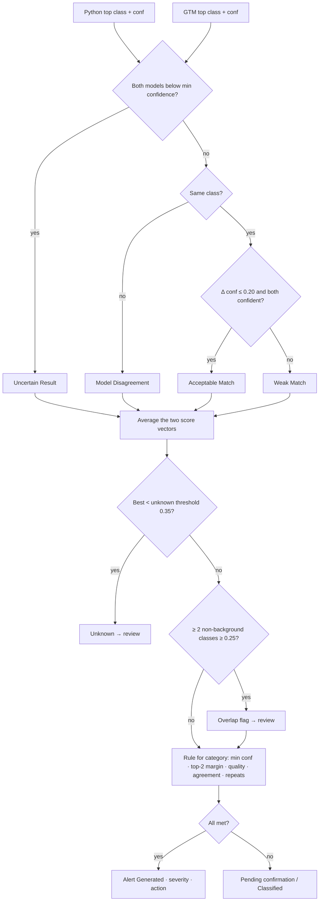

# SonicSentinel AI – Project Report

**AI-powered, web-based, real-time sound-event detection**
Theme: *AcousticX Intelligence* · Category: *NextWave AI and ML*

> Diagrams are written in Mermaid and render directly on GitHub. Numbers come from the files in `reports/` and `data/` of this repository (training run of 24-09-2026, model `XGBoost`, 10 classes).

---

## Contents

1. [Problem definition](#1-problem-definition)
2. [Background and business necessity](#2-background-and-business-necessity)
3. [Proposed solution](#3-proposed-solution)
4. [Purpose](#4-purpose)
5. [Scope](#5-scope)
6. [Assumptions](#6-assumptions)
7. [Constraints](#7-constraints)
8. [Functional requirements](#8-functional-requirements)
9. [Non-functional requirements](#9-non-functional-requirements)
10. [Application architecture](#10-application-architecture)
11. [Module descriptions](#11-module-descriptions)
12. [Database design and data dictionary](#12-database-design-and-data-dictionary)
13. [Data Flow Diagram](#13-data-flow-diagram)
14. [Use Case Diagram](#14-use-case-diagram)
15. [Activity Diagram](#15-activity-diagram)
16. [Sequence Diagram](#16-sequence-diagram)
17. [Decision Flow Diagram](#17-decision-flow-diagram)
18. [Audio-processing pipeline](#18-audio-processing-pipeline)
19. [Critical-event rule design](#19-critical-event-rule-design)
20. [Dataset](#20-dataset)
21. [Feature extraction](#21-feature-extraction)
22. [Python model design and training](#22-python-model-design-and-training)
23. [GTM model design and training](#23-gtm-model-design-and-training)
24. [Model evaluation](#24-model-evaluation)
25. [Model prediction and confidence comparison](#25-model-prediction-and-confidence-comparison)
26. [False-positive and false-negative analysis](#26-false-positive-and-false-negative-analysis)
27. [Testing strategy](#27-testing-strategy)
28. [Security](#28-security)
29. [Privacy](#29-privacy)
30. [Limitations](#30-limitations)
31. [Future enhancements](#31-future-enhancements)

---

## 1. Problem definition

Dangerous or costly events are often **heard before they are seen**: a gunshot, a scream, breaking glass, an alarm or a failing machine. Security and maintenance staff cannot listen to every room, corridor and machine all day. Manual listening is slow, inconsistent and easy to miss in noisy places, and reviewing recordings afterwards is too late to prevent harm.

**Problem:** automatically recognise ten safety-relevant sound categories in uploaded recordings and in a live microphone stream, give an explainable confidence for every category, raise the right alert for the right person, and avoid false alarms.

## 2. Background and business necessity

| Setting | Sounds of interest | Value of automatic detection |
|---|---|---|
| Factories, plants | machinery faults, alarms | earlier maintenance, less downtime |
| Public spaces, transport | gunshots, screams, aggression, glass breaking | faster security response |
| Commercial buildings, homes | glass breaking, alarms, calls for help | break-in and emergency detection |
| Farms, service centres | animal sounds, vehicle horns | context logging |

Existing practice depends on people continuously listening or reviewing audio after the fact. This is expensive, tiring and produces missed events and inconsistent decisions. An AI assistant that listens continuously, flags only relevant events and explains its confidence reduces workload and response time.

## 3. Proposed solution

A Flask web application that:

1. accepts **uploaded clips** (single or batch) and **live microphone windows**;
2. validates, cleans and segments the audio and measures its quality;
3. classifies every segment with **two independently trained models** – a Python model on 299 acoustic features and a **Google Teachable Machine** (GTM) model running in the browser;
4. compares both models (class match, confidence difference, top-2 margins) and combines them;
5. applies **configurable alert rules** (confidence, margin, repeats, agreement, quality) and assigns a severity and recommended action;
6. routes doubtful results to a **manual-review queue**;
7. stores everything for dashboards, history, timelines, reports and audit.

The application is a **competition prototype**, not a certified emergency-response or law-enforcement system.

## 4. Purpose

This report documents how SonicSentinel AI was designed, built, trained, evaluated and tested, so that stakeholders, evaluators and developers share one understanding of the system, its data, its models, its results and its limits.

## 5. Scope

**In scope:** user management with five roles; upload, batch and live-microphone input; validation, pre-processing, quality analysis; waveform and Mel-spectrogram images; Python and GTM classification of ten classes; model comparison; decision and alert rule engine; alerts, manual review, history, timeline, dashboards, reports and exports; audit trail, anomaly notifications and data retention; dataset tools, training scripts, evaluation reports and automated tests.

**Out of scope:** speech recognition (help phrases are treated as sounds), sound-source localisation, integration with emergency services, certified safety use.

## 6. Assumptions

* Users open the app in a current Chrome or Edge browser (Web Audio API, TensorFlow.js, microphone permission).
* The live microphone is used on `localhost` or over HTTPS (browsers block microphones on plain HTTP).
* GTM runs in the browser; an upload gets GTM scores only while the event page is open.
* One server; SQLite is sufficient for the prototype (PostgreSQL is supported for larger use).
* Public datasets are used under their licences for a non-commercial competition prototype.
* Help-phrase detection covers only the five defined safety phrases in the training data.
* Recorded people gave consent; no real emergencies were recorded.

## 7. Constraints

* Accuracy depends on dataset size, balance and diversity; two classes are still small (Glass Breaking 40, Machinery Fault 138 original clips).
* Recording conditions vary (microphone, distance, room, noise, overlap).
* GTM can only be trained through its web UI, and its audio *Upload* accepts only its own sample files, so training samples are recorded through the microphone input.
* The two models are trained independently, so their confidences differ even when both are right.
* Laptop CPU (no GPU) limits model size and training time.
* Privacy: microphone access requires user consent and a visible indicator.

## 8. Functional requirements

All 80 functional requirements of SRS §1.6 are implemented. The complete, item-by-item status with evidence is in [`SRS_COMPLIANCE.md`](SRS_COMPLIANCE.md); a grouped summary:

| Group | SRS items | Implementation |
|---|---|---|
| Users and access | i – iii | registration, login, lock-out after 5 failures, profile, unique `USR-xxxxx` ID, 5 roles |
| Input | iv – vii, ix | upload (WAV/MP3/FLAC/OGG/M4A), batch upload, live mic Start/Pause/Stop with 6 states, audio preview |
| Validation and pre-processing | viii, x – xv | format, size, duration, SR, channels, integrity, signal; metadata incl. bit depth; resample, mono, normalise, trim, noise reduction, 2-s segments with timestamps, padding |
| Dataset | xvi – xix | common 10-class dataset, metadata, balance check, augmentation |
| Features and visuals | xx – xxii | 299 features, waveform, Mel spectrogram |
| Python model | xxiii – xxvi | 4 algorithms compared with GridSearch tuning, scores for all classes |
| GTM model | xxvii – xxx | TF.js export integrated in the browser, same segments, scores for all classes |
| Comparison | xxxi – xxxiv | class match, \|Δ top confidence\|, top-2 margins, 4 consistency statuses, top-3 per model |
| Decision | xxxv – xl, l – lii | configurable thresholds, quality classes, uncertain/unknown/overlap detection, repeated confirmation, background-noise limit, severity |
| Category behaviour | xli – xlix | one rule per class (alert, severity, audience, action) |
| Alerts and review | liii – lxii | rule editor, real-time toasts, acknowledge/dismiss/escalate, alert history, review queue with playback, confirm/correct, comments, override, 7 event statuses |
| Dashboards and reports | lxiii – lxx | user, live and admin dashboards, timeline, 9 search filters, analytics, per-event report, CSV/Excel exports |
| Data integrity and operations | lxxi – lxxx | protected media, database storage, SHA-256 and near-duplicate detection, model versions, audit trail, error handling, anomaly alerts, privacy banner, retention |

## 9. Non-functional requirements

| # | Requirement | How it is met | Evidence |
|---|---|---|---|
| 1 | Performance: 30-s clip ≤ 8 s; live window ≤ 3 s | segment-level feature extraction, model loaded once, GTM in the browser | measured with the real model: 30-s upload **1.5 s** (max 1.7 s), live window **0.11 s** – `reports/performance.md` |
| 2 | Scalability: ≥ 20,000 records, concurrent users | indexed columns, paginated history, threaded server; PostgreSQL option | 20,020 records: every page < 0.5 s, CSV export 1.3 s; 5 concurrent users, 0 errors – `reports/performance.md` |
| 3 | Usability | responsive "Mocha" UI, role-specific navigation, badges, toasts, drag-and-drop | screenshots, demo video |
| 4 | Accuracy ≥ 85 %, macro-F1 ≥ 0.80, critical recall ≥ 85 % | 10-class XGBoost: accuracy **86.5 %**, macro-F1 **0.863**; critical recall Gunshot 0.93, Panic Scream 0.93, Aggression 0.89, Help 1.00, Glass Breaking 0.83 (6 test clips) | `reports/python_*` |
| 5 | Availability ≥ 99 % | `/healthz` health check; `run_server.bat` (waitress, automatic restart) for the local demo; Docker `HEALTHCHECK` + Render health check for deployment | `run_server.bat`, `Dockerfile`, `render.yaml`, `documentation/DEPLOYMENT.md` |

## 10. Application architecture

**Technology:** Python 3.10–3.12, Flask 3, Flask-SQLAlchemy, Flask-Login, librosa, soundfile, noisereduce, SciPy, scikit-learn, XGBoost, joblib, matplotlib, openpyxl, TensorFlow.js + speech-commands (GTM), Tailwind CSS, Chart.js, pytest, Git/GitHub, Docker.

## 11. Module descriptions

| Module | Responsibility |
|---|---|
| `audio_preprocessing/loader.py` | decode WAV/FLAC/OGG (soundfile) or MP3/M4A (FFmpeg); read metadata |
| `audio_preprocessing/validation.py` | format, size, duration, sample-rate, channel and integrity checks with clear messages |
| `audio_preprocessing/preprocess.py` | resample, mono, normalise, trim, noise reduction, segmentation, padding – shared by training and inference |
| `audio_preprocessing/quality.py` | silence, clipping, SNR/noise, low level, duration, missing frames → Good / Acceptable / Poor / Unusable |
| `feature_extraction/features.py` | 299-value feature vector per segment |
| `feature_extraction/visuals.py` | waveform and Mel-spectrogram PNGs |
| `feature_extraction/fingerprint.py` | near-duplicate fingerprint |
| `augmentation/augment.py` | training-only augmentation, class balancing (`--balance-to`) |
| `scripts/import_local_downloads.py` | imports the public datasets from `downloads/`, label mapping, per-source caps, negatives |
| `scripts/build_dataset.py` | validation, de-duplication, Audio IDs, 44.1 kHz WAV, stratified 70/15/15 split, statistics |
| `scripts/record_samples.py`, `generate_help_phrases_tts.py` | voluntary recordings with level check; synthetic help phrases |
| `python_models/train_models.py` | tuning, model selection, test metrics, confusion matrix, noise robustness |
| `python_models/inference.py` | model loading, per-class scores, clip-level aggregation |
| `gtm_model/prepare_gtm_samples.py` | 1-s GTM samples from the TRAIN split + Teachable Machine upload archives (`--zip`) |
| `static/js/gtm.js` | loads the GTM model, computes the browser spectrogram, classifies segments |
| `src/services/analysis.py` | orchestrates upload and live analysis |
| `src/services/decision.py` | comparison, uncertainty, overlap, review routing, final decision |
| `src/services/rules.py` | alert-rule loading, validation, evaluation |
| `src/services/audit.py` | audit trail and anomaly notifications |
| `src/routes/*` | pages and JSON API grouped by feature |

## 12. Database design and data dictionary

Supporting tables: `system_notifications` (admin anomaly notices), `settings` (runtime thresholds), `model_versions` (registered Python and GTM versions). Full column list with types, keys and nullability: [`DATA_DICTIONARY.md`](DATA_DICTIONARY.md); SQL: `database/schema.sql`.

## 13. Data Flow Diagram

**Level 0 (context)**

**Level 1**

## 14. Use Case Diagram

## 15. Activity Diagram

Upload → decision → alert/review:

## 16. Sequence Diagram

Live monitoring window:

## 17. Decision Flow Diagram

## 18. Audio-processing pipeline

1. **Load** – soundfile, FFmpeg fallback for MP3/M4A.
2. **Validate** – format, ≤ 25 MB, 0.5–300 s, sample rate, channels, integrity, audible signal.
3. **Quality** – RMS level, peak, clipping ratio, noise floor and SNR estimate, silence ratio, missing-frame gaps → label + issue list.
4. **Pre-process** – stereo → mono, resample to 22,050 Hz, peak-normalise, trim silence, spectral-gating noise reduction.
5. **Segment** – 2.0-s windows, 1.0-s hop, last segment padded; start/end timestamps stored.
6. **Features** – 299 values per segment (§21).
7. **Images** – waveform with segments and deciding segment highlighted; Mel spectrogram.
8. **Aggregation** – if any segment has a non-background class ≥ min confidence the clip takes the strongest such segment, otherwise the mean (so a short gunshot is not averaged away).

## 19. Critical-event rule design

Rules live in `alert_rules/alert_rules.json` and are editable in Admin → Alert rules (validated on save).

| Class | Severity | Alert | Min conf. | Top-2 margin | Consecutive | Strong conf. | Min quality | Review if unconfirmed | Escalation | Audience |
|---|---|---|---|---|---|---|---|---|---|---|
| Machinery Fault | High | yes | 0.65 | 0.15 | 2 | 0.85 | Poor | yes | → Critical after 5 | maintenance |
| Glass Breaking | High | yes | 0.65 | 0.15 | 2 | 0.80 | Acceptable | yes | → Critical after 3 | security |
| Alarm or Siren | High | yes | 0.65 | 0.15 | 2 | 0.85 | Poor | no | – | security, maintenance |
| Vehicle Horn | Low | no | 0.60 | – | 1 | – | – | – | – | security |
| Animal Sound | Low | no | 0.60 | – | 1 | – | – | – | – | security |
| Gunshot | Critical | yes | 0.70 | 0.15 | 2 | 0.85 | – | yes | – | security |
| Panic Scream | Critical | yes | 0.65 | – | 1 | – | – | yes | – | security |
| Aggression | High | yes | 0.65 | – | 1 | – | – | yes | – | security |
| Person Asking for Help | Critical | yes | 0.65 | – | 1 | – | – | yes | – | security |
| Background Noise | Informational | no (noise alert above −20 dB) | 0.50 | – | 1 | – | – | – | – | – |

`required_consecutive` detections within `repeat_window_seconds` (10 s) **or** both models ≥ `strong_confidence` confirm an event, so one unstable window does not raise a critical alarm.

## 20. Dataset

### 20.1 Collection method

| Source | Licence | Used for |
|---|---|---|
| UrbanSound8K | CC BY-NC 3.0 | siren, car horn, dog bark, gunshot; air conditioner, engine idling, street music, children playing, drilling, jackhammer → Background |
| ESC-50 | CC BY-NC 3.0 | glass breaking, siren, clock alarm, car horn, 11 animal classes; 35 everyday/look-alike classes (fireworks, thunderstorm, door knock, crying baby, laughing, coughing, chainsaw …) → Background |
| MIMII | CC BY-SA 4.0 | `abnormal` → Machinery Fault; `normal` → Background (normal machinery) |
| Kaggle gunshot audio | per Kaggle page | Gunshot, 9 weapons (round-robin selection) |
| Kaggle Human Screaming Detection | per Kaggle page | `Screaming` → Panic Scream; `NotScreaming` → Background (ordinary voices) |
| VSD Violence Sound Dataset | per dataset page | one ≤ 6-s clip per annotated violence interval → Aggression; 5-s chunks of non-violent films → Background |
| Team recordings (consented, anonymous codes) | own | Person Asking for Help, Background Noise of our rooms |
| Windows offline TTS (SAPI) | synthetic | Person Asking for Help (the 5 SRS phrases + variants) |

Tools: `scripts/import_local_downloads.py` (label mapping in `config/dataset_mapping.json`, max 400 clips per class per source, 250 for Background, round-robin over original labels), `scripts/record_samples.py`, `scripts/generate_help_phrases_tts.py`.

### 20.2 Description (original clips after validation)

| Class | ESC-50 | UrbanSound8K | MIMII | Kaggle gunshot | Kaggle scream | VSD | TTS | Team | **Total** |
|---|---|---|---|---|---|---|---|---|---|
| Machinery Fault | | | 138 | | | | | | **138** |
| Glass Breaking | 40 | | | | | | | | **40** |
| Alarm or Siren | 80 | 393 | | | | | | | **473** |
| Vehicle Horn | 40 | 325 | | | | | | | **365** |
| Animal Sound | 400 | 374 | | | | | | | **774** |
| Gunshot | | 349 | | 382 | | | | | **731** |
| Panic Scream | | | | | 400 | | | | **400** |
| Aggression | | | | | | 298 | | | **298** |
| Person Asking for Help | | | | | | | 204 | 17 | **221** |
| Background Noise | 250 | 249 | 250 | | 250 | 150 | | 40 | **1,189** |
| **Total** | 810 | 1,690 | 388 | 382 | 650 | 448 | 204 | 57 | **4,629** |

* **Split** (stratified, by original clip): train 3,240 · validation 694 · test 695.
* **Total audio** ≈ 6.6 h; mean 5.1 s per clip (0.5 s – 360 s).
* **Quality:** Good 3,195 · Acceptable 1,208 · Poor 226.
* **Rejected:** 241 (217 near-silent/too short, 24 exact duplicates) – `data/dataset_rejected.csv`.
* Every clip: unique Audio ID `AUD-xxxxxx`, 44.1 kHz mono 16-bit WAV, metadata in `data/dataset_metadata.csv` (source, licence, environment, device, distance, split, quality, SHA-256).

### 20.3 Data augmentation

`python -m augmentation.augment --per-clip 1 --balance-to 600` – TRAIN split only. Each copy applies 1–3 random operations: background-noise mixing at random SNR, time shift, pitch shift ±2 semitones, time stretch 0.85–1.15×, volume −12…+6 dB, limited reverberation, distance simulation, device (band-pass) simulation. Small classes get more copies (up to 10 per clip) so each class has ≈ 600 training clips. **5,030** augmented clips; they keep `parent_audio_id`, stay in the train split and are never counted as originals.

### 20.4 Leakage prevention

Split by original clip; segments and augmented copies stay with their parent; GroupKFold by Audio ID during tuning; GTM samples cut only from TRAIN recordings; test split used once.

## 21. Feature extraction

| Feature group | Values |
|---|---|
| 40 MFCC – mean, std | 80 |
| 40 Δ-MFCC – mean | 40 |
| 64 log-Mel bands – mean, std | 128 |
| 12 chroma – mean, std | 24 |
| 7 spectral contrast – mean | 7 |
| ZCR, RMS, spectral centroid, bandwidth, roll-off, onset strength – mean/std/max | 18 |
| spectral flatness, tempo | 2 |
| **Total per 2-s segment** | **299** |

## 22. Python model design and training

* Pipeline: `StandardScaler` → classifier. Candidates: **XGBoost** (300 trees, hist), **Random Forest** (300 trees, balanced), **MLP** (256-128, early stopping), SVM (RBF, probability) – SVM is available but was skipped in the final run because it needs hours on 38k segments.
* Tuning: `GridSearchCV`, `GroupKFold(3)` by Audio ID, macro-F1.
* Training data: 8,270 train clips (3,240 originals + 5,030 augmented) → **38,210 segments × 299 features**; quiet segments of event clips are dropped.
* Selection: best clip-level validation macro-F1, critical recall as tie-breaker.

| Model | Best parameters | CV macro-F1 | Val accuracy | Val macro-F1 | Val precision | Val recall | Train time |
|---|---|---|---|---|---|---|---|
| **XGBoost** ✅ | max_depth 6, learning_rate 0.1 | 0.790 | **0.844** | **0.847** | 0.858 | 0.850 | 1,462 s |
| MLP | alpha 0.001 | 0.779 | 0.805 | 0.818 | 0.805 | 0.848 | 292 s |
| Random Forest | max_depth None, min_samples_leaf 1 | 0.742 | 0.769 | 0.802 | 0.880 | 0.771 | 953 s |

Saved bundle: `python_models/saved/sonic_model.joblib` (pipeline, class list, version, feature names, settings, metrics).

## 23. GTM model design and training

* Google Teachable Machine **Audio Project** (speech-commands BROWSER_FFT transfer learning, 1-s spectrogram windows at 44.1 kHz).
* Samples: `python -m gtm_model.prepare_gtm_samples --max-per-class 400 --zip` cuts 1-s windows from the **same TRAIN recordings** and writes one Teachable Machine archive per class (its own `samples.json` + `.webm` format, spectrograms computed like its recorder), uploaded with *Upload → <Class>.zip*. Run 1 (9 classes) had used playlist playback into the microphone recorder.
* Export: TensorFlow.js → `gtm_model/model/` (`model.json`, `metadata.json`, `weights.bin`).
* Integration: `static/js/gtm.js` reproduces the Web Audio spectrogram (FFT 2048, 43 × 232) for uploads and live windows; segments > 1 s are scored in 1-s windows with 0.5-s hop and averaged; scores are posted to `/api/events/<id>/gtm`. GTM never receives the Python output.
* Training configuration, sample counts, observations and screenshots: [`GTM_TRAINING_LOG.md`](GTM_TRAINING_LOG.md).

## 24. Model evaluation

### 24.1 Python model – unseen test split (695 clips)

| Metric | Value | SRS target |
|---|---|---|
| Accuracy | **0.865** | ≥ 0.85 ✅ |
| Macro precision | 0.847 | |
| Macro recall | 0.895 | |
| Macro F1 | **0.863** | ≥ 0.80 ✅ |

| Class | Precision | Recall | F1 | Test clips |
|---|---|---|---|---|
| Machinery Fault | 0.77 | 1.00 | 0.87 | 20 |
| Glass Breaking | 0.56 | 0.83 | 0.67 | 6 |
| Alarm or Siren | 0.93 | 0.92 | 0.92 | 71 |
| Vehicle Horn | 1.00 | 0.87 | 0.93 | 55 |
| Animal Sound | 0.88 | 0.79 | 0.84 | 116 |
| Gunshot | 0.96 | 0.93 | 0.94 | 110 |
| Panic Scream | 0.64 | 0.93 | 0.76 | 60 |
| Aggression | 0.89 | 0.89 | 0.89 | 45 |
| Person Asking for Help | 1.00 | 1.00 | 1.00 | 33 |
| Background Noise | 0.84 | 0.78 | 0.81 | 179 |

**Critical-class recall:** Gunshot 0.93 ✅ · Panic Scream 0.93 ✅ · Aggression 0.89 ✅ · Person Asking for Help 1.00 ✅ · Glass Breaking 0.83 (5 of 6 test clips – one clip below target).

Confusion matrix: `reports/confusion_matrix_python.png`. Class-wise CSV: `reports/python_classwise_test.csv`.

### 24.2 Noise robustness

White noise is added to every test clip at 20, 10 and 5 dB SNR and the clips are re-classified (`reports/noise_robustness.csv`). 

| Condition | Accuracy | Macro-F1 |
|---|---|---|
| Clean | 0.865 | 0.863 |
| SNR 20 dB | 0.809 | 0.780 |
| SNR 10 dB | 0.711 | 0.602 |
| SNR 5 dB | 0.663 | 0.529 |

Moderate noise is handled; strong noise lowers accuracy, so such audio is rated Poor quality and critical detections in it are sent to manual review.

### 24.3 GTM model

Measured in the app with Admin → Model comparison → *Run test-set evaluation* (the browser runs GTM on the same unseen test clips) and exported to Excel – see §25.

## 25. Model prediction and confidence comparison

For every event the app stores and shows: both predicted classes, both confidence vectors (all classes), class-match status, **\|Python top − GTM top\|**, both top-2 margins, the consistency status and the combined decision. The **comparison report** (SRS deliverable 6) is generated in Admin → Model comparison on the unseen test split and exported to Excel with the columns required by the SRS (Audio ID, file, actual class, both predictions and all confidences, match, confidence difference, top-2 margins, quality, severity, alert, review, final decision, correct/incorrect).

Expected pattern (observed in manual tests): both models agree on loud, clean events (siren, horn, gunshot); disagreements concentrate on Background vs Animal/Scream and on short impulsive sounds, where GTM – trained from speaker playback – is less reliable. Such cases are routed to manual review automatically.

## 26. False-positive and false-negative analysis

Derived from the test set (TP = recall × support, FP = TP/precision − TP, FN = support − TP):

| Class | FP | FN | Main cause |
|---|---|---|---|
| Panic Scream | **32** | 4 | ordinary shouting / crying / laughing (NotScreaming, crying baby) predicted as scream – high recall was preferred for a critical class |
| Background Noise | 26 | **39** | mixed everyday sounds; some quiet event clips predicted as background |
| Animal Sound | 12 | **24** | short, distant barks masked by street noise |
| Machinery Fault | 6 | 0 | normal-machinery clips from the same MIMII recording set |
| Alarm or Siren | 5 | 6 | siren vs horn vs clock alarm |
| Aggression | 5 | 5 | film audio with music and speech |
| Gunshot | 4 | 8 | door knocks / impacts; very short shots in long clips |
| Glass Breaking | 4 | 1 | impacts and clinks; only 40 training clips |
| Vehicle Horn | 0 | 7 | horn confused with siren/alarm |
| Person Asking for Help | 0 | 0 | test clips are mostly TTS – real-voice performance must be checked live |

**Mitigations in the system:** repeated-detection confirmation (Gunshot/Glass/Machinery need 2 windows or strong agreement), top-2 margin, model agreement, quality gate and manual review for doubtful cases. **Planned data fixes:** more Glass Breaking and real-voice help recordings, more scream look-alikes as Background.

## 27. Testing strategy

* **Automated:** `python -m pytest -q` → **58 tests pass** – functional, integration, boundary, negative, security, database, audio-format, microphone/live, silence, clipping, noise, pre-processing, feature, Python model, GTM API, comparison, alert-rule, duplicate, low-confidence and overlap tests (details: [`TESTING.md`](TESTING.md)).
* **Performance/scalability:** `python scripts/benchmark_performance.py` (30-s uploads, live windows, 20,000 records, concurrent users).
* **Model:** validation for selection, one-time test evaluation, noise robustness, confusion matrix.
* **Manual:** one clip per class, every file in `sample_audio/test_cases/`, live mic with phone playback, role checks, test-set comparison report.
* **Hidden-test readiness:** augmentation with noise/echo/distance/device, look-alike negatives, re-encoded duplicate detection, quality warnings instead of crashes, thresholds tuned on validation only.

## 28. Security

* Werkzeug password hashing; policy ≥ 8 characters with letters and numbers; lock-out after 5 failed logins; failed-login anomaly notifications.
* CSRF token on every POST (forms and fetch); HttpOnly, SameSite=Lax session cookies; `SONIC_SECRET_KEY` from the environment.
* Role-based access on every page and API (401/403), alerts routed by audience, media files served only to authorised users.
* Upload limits (size, type, duration) and FFmpeg decoding in a subprocess with timeout.
* Audit trail of logins, uploads, microphone sessions, predictions, alerts, reviews, overrides, exports and model updates.
* No external generative-AI API; classification only by the team's two models.

## 29. Privacy

* The microphone starts only after the user presses Start and grants browser permission; a red banner is shown on every page while it is active; nothing is recorded while monitoring is stopped.
* Only 2-s windows are sent to the server; retention periods for audio (90 days) and records (365 days) are configurable.
* Training recordings were made with consent and anonymous speaker codes; no real emergencies; public data used under licence and not redistributed.

## 30. Limitations

* Glass Breaking (40) and Machinery Fault (138, one recording set) are small; their scores are less reliable.
* Person Asking for Help is mostly synthetic (TTS); real voices were recorded but many were rejected as near-silent because the microphone did not capture them.
* Panic Scream has many false positives from ordinary shouting/crying.
* GTM was trained from speaker playback through a microphone and is less accurate than the Python model.
* Accuracy drops with strong noise; very short events in long noisy recordings may be missed.
* GTM runs in the browser, so upload results get GTM scores only while the page is open.
* SQLite suits one server; the free cloud tier has a temporary disk.

## 31. Future enhancements

* CNN / transfer-learning audio model (e.g. YAMNet, PANNs embeddings) on log-Mel spectrograms.
* Larger, balanced dataset: FSD50K glass/shatter and shout/yell, more MIMII machines, real help-phrase recordings from many speakers and devices.
* Per-class threshold calibration on the validation split; overlapping-event (multi-label) training.
* Sound-source direction with multi-microphone arrays; mobile app and push notifications.
* PostgreSQL + object storage, WebSocket alerts, containerised GPU inference.
